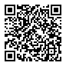

## 项目宗旨
通过激励机制鼓励大家对Move做出贡献，获得奖励，并且在github留下痕迹，最终完善Move的教程和推广体系

## 社交账号
- telegram:  https://t.me/move_cn
- X(twitter): https://twitter.com/move_cn
- QQ群: 79489587
- 微信公众号: 
- Sui中文开发群: https://t.me/sui_dev_cn

## Move介绍
Move 是一门专为编写安全、可验证的区块链智能合约而设计的编程语言

## Sui介绍
Sui 是一种高吞吐量、低延迟的区块链，旨在为 Web3 应用程序提供无缝的用户体验. Move语言是Sui区块链开发应用的编程语言

## 文字教程贡献
- 每篇文章 100-500RMB(等值的SUI)
> 原则上需要开源，文章需要发布到登链, 掘金, 知乎等公共平台上，版权归作者所有，可以授权给Move中文微信公众号转载(会标注原作者和原文)
> 最好能带上move中文的有效社群加入途径

## 视频教程贡献
- 每个视频 100-600RMB(等值的SUI)
- 有效内容: 100RMB/10分钟计价
- 文章和视频配套可以双重Buff

# 如何认证奖励
首先需要在creator下面根据自己的github id创建自己的目,根据githubid 目录提供的模板填写自己的信息
其中最重要的就是Sui钱包地址，后续收入都会打入这个地址

